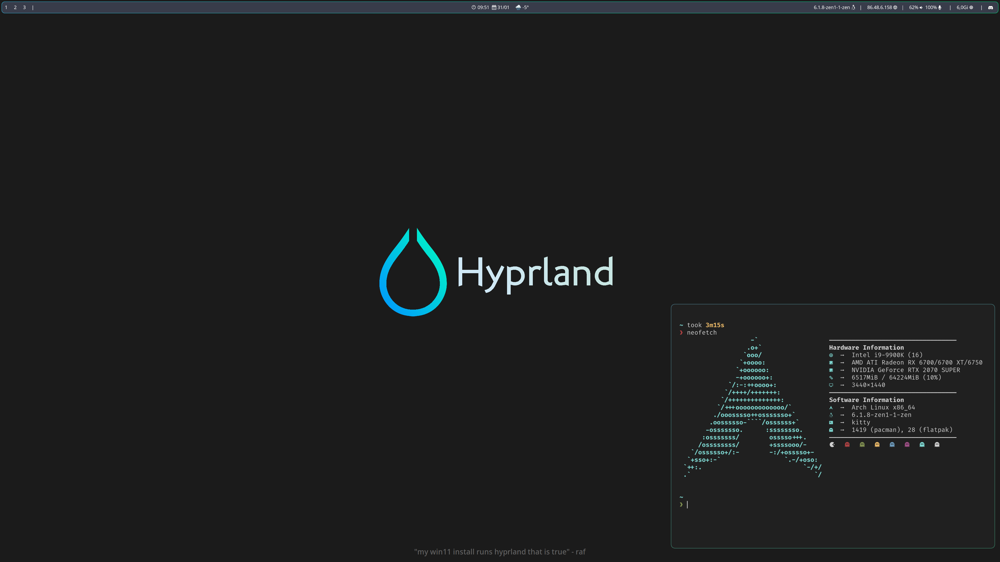

# dotfiles

repo generated by [chezmoi](https://www.chezmoi.io/quick-start/#using-chezmoi-across-multiple-machines)

hyprland config is based on <https://github.com/ChrisTitusTech/hyprland-titus>, but uses wofi instead of rofi

